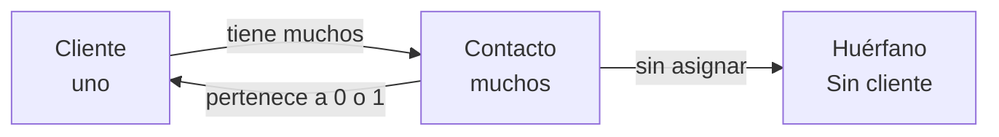
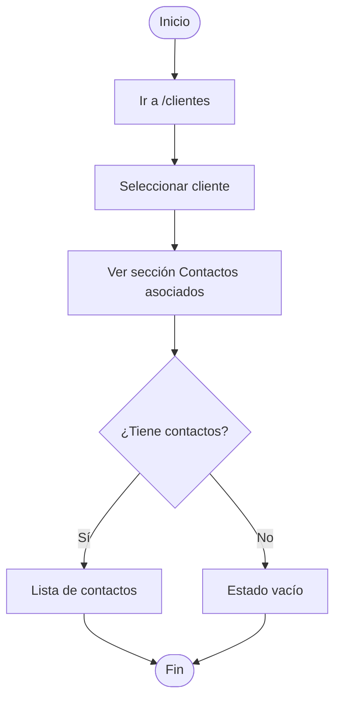
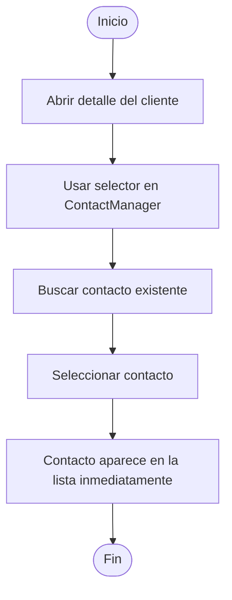
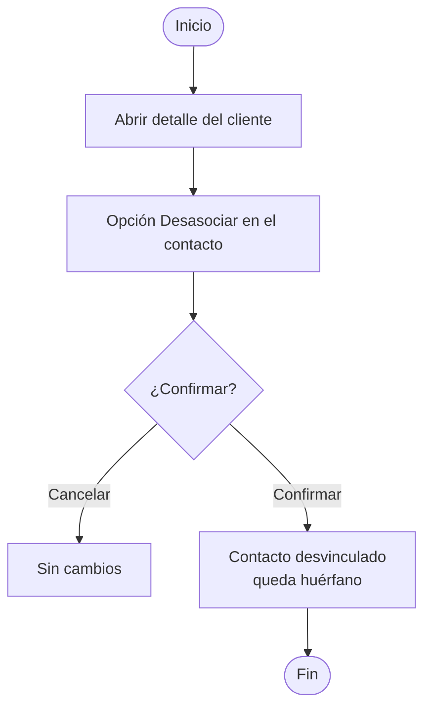
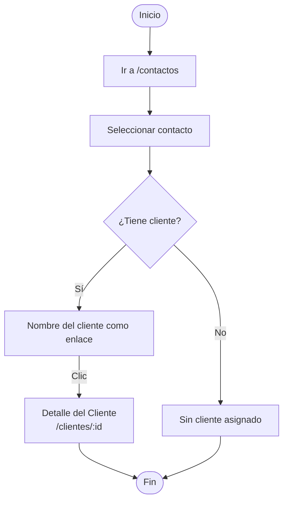
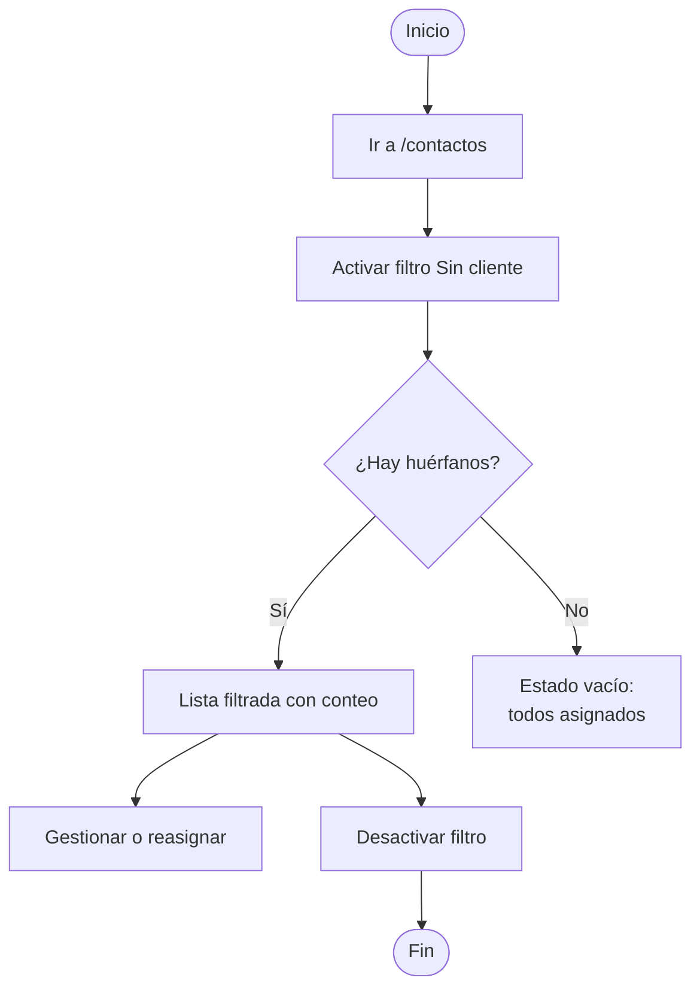
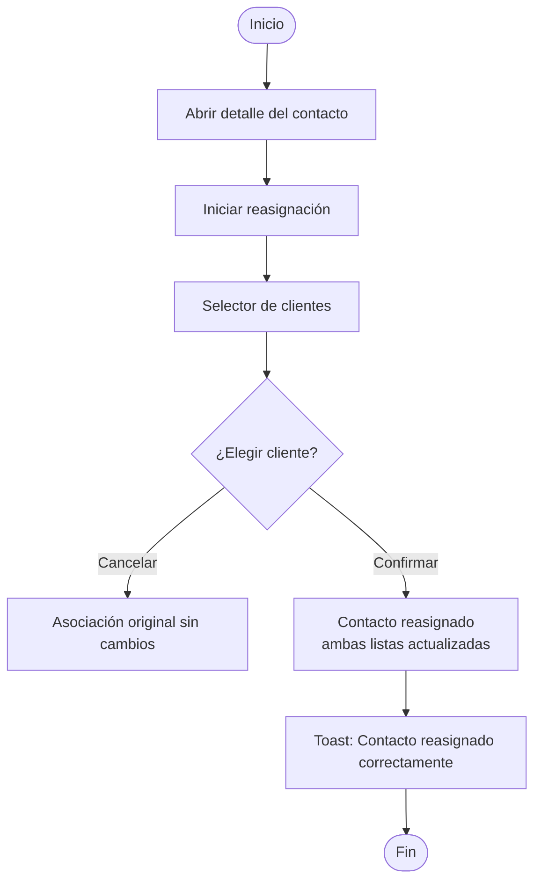

# Asociación Cliente ↔ Contacto — Guía de Usuario

## Asociación Cliente ↔ Contacto

La funcionalidad de Asociación permite vincular contactos a clientes y navegar entre ellos de forma bidireccional. Desde el detalle de un cliente puedes ver y gestionar todos sus contactos. Desde el detalle de un contacto puedes ver a qué cliente pertenece y navegar a él con un clic. La asociación, desasociación y reasignación se realizan sin perder el contexto de navegación actual.

**Relación:**



**Navegación disponible:**
- **Cliente → Contacto**: desde el detalle del cliente, clic en un contacto → detalle del contacto (máx. 2 clics)
- **Contacto → Cliente**: desde el detalle del contacto, clic en el nombre del cliente → detalle del cliente (1 clic)

📸 [Screenshot: ASOCIACION_CONTACTOS_EN_CLIENTE — Sección ContactManager en el detalle de un cliente]

**[Source: F4 Story 4.1], [Source: F4 Story 4.2]**

---

## Flujos de Trabajo

### Flujo 1: Ver los Contactos de un Cliente

**Objetivo**: Consultar todos los contactos asociados a un cliente desde su detalle.

1. Navega a `/clientes` y selecciona un cliente
2. En el panel derecho, busca la sección **Contactos asociados** (ContactManager)
   - Si tiene contactos: se muestran en lista
   - Si no tiene: aparece un estado vacío indicando que aún no hay contactos vinculados



**[Source: F4 Story 4.1]**

---

### Flujo 2: Asociar un Contacto Existente a un Cliente

**Objetivo**: Vincular un contacto que ya existe en el sistema a un cliente.

1. Abre el detalle del cliente
2. En la sección **Contactos asociados**, usa el selector para buscar y agregar un contacto existente
3. El contacto se vincula inmediatamente y aparece en la lista

📸 [Screenshot: ASOCIACION_ASOCIAR_CONTACTO — Selector de contactos para vincular a un cliente]



**[Source: F4 Story 4.2]**

---

### Flujo 3: Crear un Nuevo Contacto Vinculado al Cliente

**Objetivo**: Crear un contacto nuevo que quede automáticamente asociado al cliente actual.

1. Abre el detalle del cliente
2. En la sección **Contactos asociados**, usa la opción de crear nuevo contacto
3. Completa los datos del contacto (Nombre, Cargo, Teléfono, Email) y guarda
4. El contacto creado queda vinculado automáticamente al cliente

💡 **Tip**: Esta es la forma más rápida de crear un contacto que ya pertenece a un cliente específico, sin necesidad de reasignarlo después.

**[Source: F4 Story 4.2]**

---

### Flujo 4: Desasociar un Contacto de un Cliente

**Objetivo**: Desvincular un contacto de un cliente sin eliminar ninguno de los dos.

1. Abre el detalle del cliente
2. En la sección **Contactos asociados**, usa la opción de desasociar sobre el contacto que deseas desvincular
3. Confirma la acción

📸 [Screenshot: ASOCIACION_DESASOCIAR_CONFIRM — Confirmación de desasociación]

El contacto desaparece de la lista del cliente y queda como contacto huérfano. Sigue existiendo en `/contactos`.

⚠️ El contacto desasociado no se elimina. Puedes encontrarlo en `/contactos` con el filtro **"Sin cliente"** y reasignarlo cuando lo necesites.



**[Source: F4 Story 4.2]**

---

### Flujo 5: Navegar de un Cliente a un Contacto

**Objetivo**: Acceder al detalle completo de un contacto desde el detalle de su cliente en 2 clics o menos.

1. Selecciona un cliente de la lista (`/clientes`) — **clic 1**
2. En la sección **Contactos asociados**, haz clic en el contacto deseado — **clic 2**
3. Eres llevado a `/contactos/:contactoId` con el detalle completo del contacto

📸 [Screenshot: ASOCIACION_NAVEGAR_CONTACTO — Detalle del contacto accedido desde el cliente]

Para volver al cliente: usa el botón **Volver** o el retroceso del navegador.

```mermaid
flowchart TD
    Start([Inicio]) --> Lista[/clientes — Lista]
    Lista -->|Clic 1| DetCliente[Detalle del Cliente]
    DetCliente --> ContactManager[Sección Contactos]
    ContactManager -->|Clic 2| DetContacto[Detalle del Contacto\n/contactos/:id]
    DetContacto --> Volver[Volver al cliente]
    Volver --> DetCliente
```

**[Source: F4 Story 4.3]**

---

### Flujo 6: Ver el Cliente Asociado desde un Contacto

**Objetivo**: Identificar y navegar al cliente de un contacto desde su detalle.

1. Selecciona un contacto en `/contactos`
2. En el detalle, el nombre del cliente aparece como enlace
   - Si tiene cliente: clic en el nombre → navega a `/clientes/:clienteId`
   - Si no tiene: aparece *"Sin cliente asignado"*

📸 [Screenshot: ASOCIACION_CLIENTE_EN_CONTACTO — Nombre del cliente como enlace en el detalle del contacto]



**[Source: F4 Story 4.4]**

---

### Flujo 7: Filtrar Contactos Huérfanos (Sin Cliente)

**Objetivo**: Identificar todos los contactos que no tienen cliente asignado.

1. Navega a `/contactos`
2. Activa el filtro **Sin cliente**
3. La lista muestra solo contactos huérfanos con su conteo total
4. Selecciona cualquiera para reasignarlo o gestionarlo
5. Desactiva el filtro para ver la lista completa

📸 [Screenshot: ASOCIACION_FILTRO_HUERFANOS — Filtro "Sin cliente" activo mostrando huérfanos]



**[Source: F4 Story 4.5]**

---

### Flujo 8: Reasignar un Contacto a un Cliente Diferente

**Objetivo**: Mover un contacto de su cliente actual a otro cliente.

1. Abre el detalle del contacto en `/contactos`
2. Inicia la acción de reasignación → aparece un selector con todos los clientes disponibles
3. Selecciona el nuevo cliente y confirma

📸 [Screenshot: ASOCIACION_REASIGNAR_SELECTOR — Selector de clientes para reasignar el contacto]

El contacto aparece en el nuevo cliente y desaparece del anterior. Toast: *"Contacto reasignado correctamente"*.

📸 [Screenshot: ASOCIACION_REASIGNAR_EXITO — Toast "Contacto reasignado correctamente"]

⚠️ La reasignación es inmediata y visible para todos los usuarios. Ambos listados (cliente anterior y nuevo) se actualizan al instante.



**[Source: F4 Story 4.6]**

---

## Solución de Problemas

### No veo la sección de contactos en el detalle del cliente

**Causa**: La sección ContactManager puede no haberse cargado aún o el servidor no está disponible.
**Solución**: Espera un momento y recarga la página. Si aparece un botón de reintento, úsalo.

### El contacto desasociado no aparece en la lista de contactos

**Causa**: Puede estar oculto si hay una búsqueda activa en `/contactos`.
**Solución**: Limpia el campo de búsqueda en `/contactos` o activa el filtro **"Sin cliente"** para encontrarlo.

### La reasignación no se refleja en el otro cliente

**Causa**: Los datos son en tiempo real, pero puede haber un pequeño retardo si la conexión es lenta.
**Solución**: Refresca la página del cliente si no se actualiza después de unos segundos.

### Al hacer clic en el nombre del cliente desde un contacto, no navega

**Causa**: El contacto puede no tener cliente asignado, o el enlace no está activo.
**Solución**: Verifica que el contacto tenga un cliente asignado — si muestra *"Sin cliente asignado"*, primero debes reasignarlo.

---

## Preguntas Frecuentes

**¿Un contacto puede estar vinculado a más de un cliente?**
No. Un contacto pertenece a un único cliente a la vez. Para moverlo, usa la reasignación.

**¿Cuántos clics necesito para ir de un cliente a un contacto?**
Máximo 2: uno para seleccionar el cliente en la lista, otro para hacer clic en el contacto dentro del ContactManager.

**¿Puedo desvincular un contacto sin eliminarlo?**
Sí. La desasociación solo rompe el vínculo; el contacto permanece en el sistema como huérfano y puede ser reasignado.

**¿Qué pasa con los contactos si elimino un cliente?**
Los contactos quedan como huérfanos (sin cliente asignado). Puedes encontrarlos en `/contactos` con el filtro "Sin cliente" y reasignarlos a otro cliente.

**¿La reasignación es visible inmediatamente para todos?**
Sí. Los cambios se reflejan en tiempo real para todos los usuarios conectados — tanto en el cliente anterior como en el nuevo.

**¿Puedo crear un contacto y asignarlo a un cliente al mismo tiempo?**
Sí. Desde el detalle del cliente, usa la opción de crear nuevo contacto en la sección ContactManager. El contacto quedará automáticamente asociado a ese cliente.

**¿Cómo sé cuántos contactos huérfanos hay?**
Activa el filtro "Sin cliente" en `/contactos`. El conteo de huérfanos aparece junto al filtro activo.

---

## Glosario

**Asociación**: Vínculo entre un contacto y un cliente. Un contacto puede tener 0 o 1 cliente.

**ContactManager**: Componente en el detalle del cliente que lista y gestiona los contactos asociados.

**Contacto huérfano**: Contacto sin cliente asignado (`clienteId = null`). Identificable con el filtro "Sin cliente".

**Deep linking**: URL única por registro que permite acceso directo y navegación bidireccional entre clientes y contactos.

**Desasociación**: Acción de romper el vínculo entre un contacto y su cliente sin eliminar ninguno de los dos registros.

**Filtro "Sin cliente"**: Opción en `/contactos` que muestra únicamente los contactos sin cliente asignado con su conteo.

**Navegación bidireccional**: Posibilidad de navegar tanto de cliente → contacto como de contacto → cliente con uno o dos clics.

**Reasignación**: Acción de cambiar el cliente de un contacto de uno existente a otro, sin eliminar ningún registro.

---

## Índice de Capturas de Pantalla

| ID | Sección | Descripción | Estado |
|----|---------|-------------|--------|
| ASOCIACION_CONTACTOS_EN_CLIENTE | Asociación C↔C | ContactManager en el detalle del cliente | Pendiente |
| ASOCIACION_ASOCIAR_CONTACTO | Flujo 2 | Selector de contactos para vincular | Pendiente |
| ASOCIACION_DESASOCIAR_CONFIRM | Flujo 4 | Confirmación de desasociación | Pendiente |
| ASOCIACION_NAVEGAR_CONTACTO | Flujo 5 | Detalle del contacto accedido desde el cliente | Pendiente |
| ASOCIACION_CLIENTE_EN_CONTACTO | Flujo 6 | Nombre del cliente como enlace en el detalle del contacto | Pendiente |
| ASOCIACION_FILTRO_HUERFANOS | Flujo 7 | Filtro "Sin cliente" activo mostrando huérfanos | Pendiente |
| ASOCIACION_REASIGNAR_SELECTOR | Flujo 8 | Selector de clientes para reasignar | Pendiente |
| ASOCIACION_REASIGNAR_EXITO | Flujo 8 | Toast "Contacto reasignado correctamente" | Pendiente |
| ASOCIACION_SIN_CLIENTE | Flujo 6 | Mensaje "Sin cliente asignado" en detalle del contacto | Pendiente |

**Total**: 9 capturas pendientes de capturar.

---

*Generado: 2026-03-18 · Feature: F4 — Asociación Cliente ↔ Contacto · Estado: Borrador*
