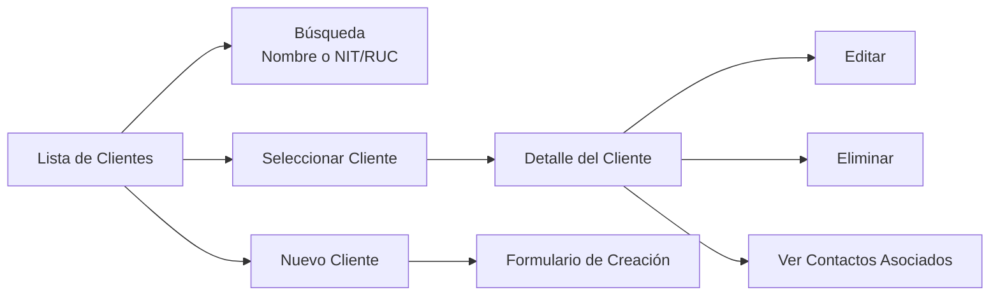
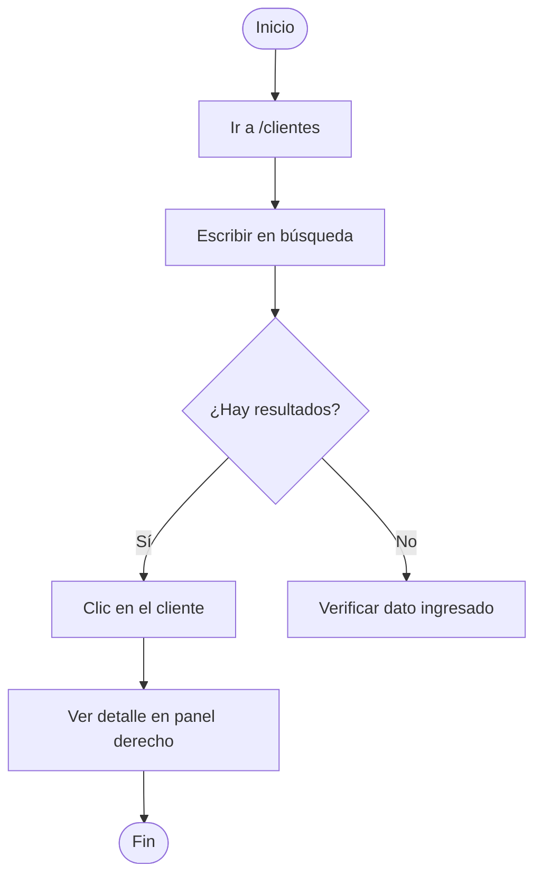
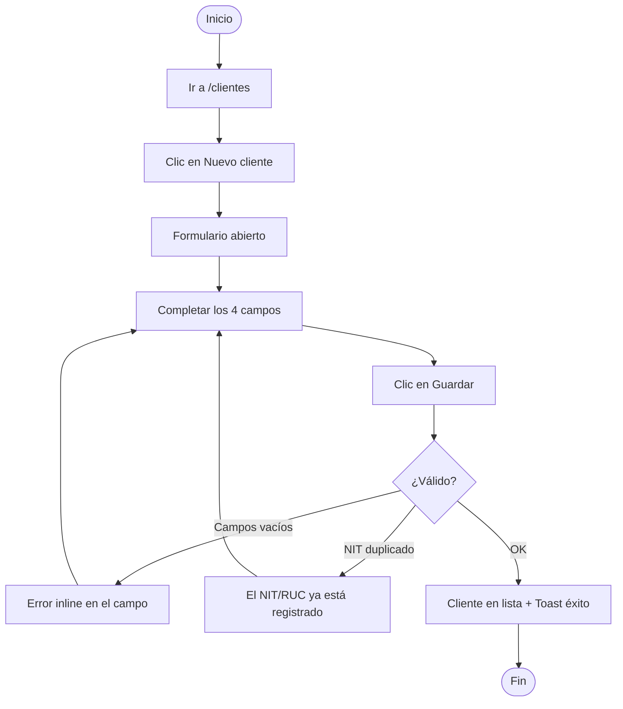
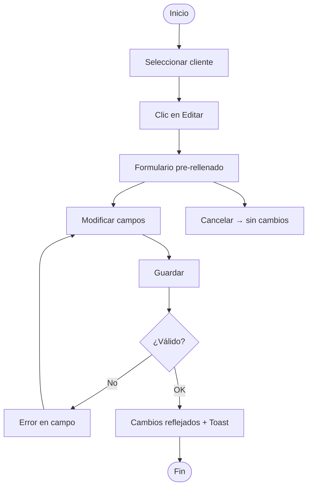
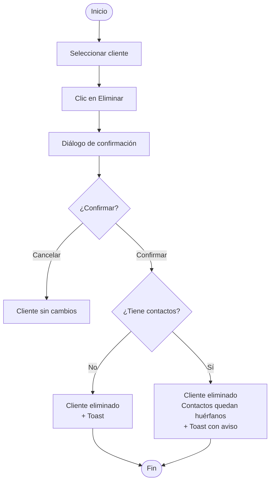

# Siesa-Agents — Guía de Usuario

## Introducción

### ¿Qué es Siesa-Agents?

Siesa-Agents es una aplicación web para la gestión comercial de clientes y contactos, diseñada para equipos comerciales y de soporte en pequeñas y medianas empresas. Resuelve el problema crítico de la información fragmentada en sistemas desconectados (Excel, contactos del teléfono, correos electrónicos) unificando ambas entidades en un único lugar con trazabilidad real y una relación bidireccional de primera clase entre ellas.

El sistema es intencionalmente simple y enfocado: sin funcionalidades innecesarias ni complejidad empresarial. Permite al equipo comercial mantener un catálogo organizado de empresas cliente y sus personas de contacto, con búsqueda en tiempo real, actualizaciones inmediatas y navegación fluida entre registros relacionados.

### ¿Para quién es esta guía?

Esta guía está diseñada para **miembros del equipo comercial** (ejecutivos de ventas, coordinadores de cuentas, administradores) que usan Siesa-Agents en su trabajo diario. Se asume familiaridad básica con aplicaciones web — no se requiere experiencia técnica.

### Cómo usar esta guía

La guía está organizada por funcionalidad. Cada sección cubre una feature independiente del sistema: Gestión de Clientes, Gestión de Contactos y Asociación Cliente ↔ Contacto. Dentro de cada sección encontrarás flujos de trabajo paso a paso, diagramas del proceso y respuestas a preguntas frecuentes.

**Convenciones:**
- 📸 **[Screenshot: ID — Descripción]**: Captura de pantalla pendiente de capturar
- **[Source: FX Story Y.Z]**: Referencia al requisito fuente
- ⚠️ **Advertencia**: Información crítica antes de actuar
- 💡 **Tip**: Consejo útil

---

## Primeros Pasos

### Acceso al Sistema

1. Abre tu navegador e ingresa la URL de Siesa-Agents
2. Ingresa tu usuario y contraseña → **Iniciar Sesión**
3. La interfaz principal se divide en dos paneles:
   - **Panel izquierdo**: lista de registros con búsqueda
   - **Panel derecho**: detalle del registro seleccionado

📸 [Screenshot: UI_CLIENTES_LAYOUT — Interfaz principal mostrando lista de clientes y panel de detalle]

```mermaid
flowchart LR
    Login[Inicio de Sesión] --> Nav[Menú Principal]
    Nav --> Clientes[/clientes]
    Nav --> Contactos[/contactos]
    Clientes --> Lista[Panel Izquierdo\nLista + Búsqueda]
    Clientes --> Detalle[Panel Derecho\nDetalle del Cliente]
```

---

## Conceptos Clave

**Cliente**: Empresa o entidad comercial con campos obligatorios: Nombre, NIT/RUC, Teléfono y Ciudad.

**NIT/RUC**: Identificador tributario único del cliente. No pueden existir dos clientes con el mismo NIT/RUC.

**Contacto**: Persona de contacto asociada a un cliente. Puede existir sin cliente asignado (contacto huérfano).

**Deep linking**: Cada registro tiene una URL única (`/clientes/:id`, `/contactos/:id`) que puedes compartir o guardar como marcador.

**Panel de dos columnas**: El panel izquierdo muestra la lista; el derecho muestra el detalle. Ambos permanecen visibles simultáneamente en desktop.

**ContactManager**: Componente en el detalle del cliente que lista y gestiona los contactos asociados.

---

## Gestión de Clientes

La funcionalidad de Gestión de Clientes permite al equipo comercial mantener un catálogo completo y actualizado de todas las empresas cliente. Desde `/clientes` puedes buscar, consultar, crear, editar y eliminar clientes.

⚠️ **Advertencia**: Al eliminar un cliente con contactos asociados, los contactos **no se eliminan** — quedan sin cliente asignado. El sistema te lo notificará con un toast.

**Campos del registro de cliente:**

| Campo | Obligatorio | Descripción |
|-------|-------------|-------------|
| Nombre | ✅ | Razón social o nombre de la empresa |
| NIT/RUC | ✅ | Identificador tributario (único en el sistema) |
| Teléfono | ✅ | Número de contacto principal |
| Ciudad | ✅ | Ciudad donde opera el cliente |

📸 [Screenshot: CLIENTES_LISTA — Lista de clientes con Nombre y NIT/RUC visibles en el panel izquierdo]



**[Source: F2 Story 2.1], [Source: F2 Story 2.2]**

---

## Flujos de Trabajo

### Flujo 1: Buscar un Cliente

**Objetivo**: Encontrar un cliente por nombre o NIT/RUC.

1. Navega a `/clientes`
2. Escribe en el campo de búsqueda del panel izquierdo — la lista se filtra en tiempo real
3. Haz clic en el cliente para ver su detalle en el panel derecho

📸 [Screenshot: CLIENTES_BUSQUEDA — Campo de búsqueda activo con lista filtrada]

💡 **Tip**: La búsqueda funciona con coincidencias parciales desde las primeras letras o dígitos. Admite hasta 500 registros con resultados en menos de 1 segundo.



**[Source: F2 Story 2.1]**

---

### Flujo 2: Ver el Detalle de un Cliente

**Objetivo**: Consultar toda la información de un cliente.

1. Selecciona un cliente en la lista (panel izquierdo)
2. El panel derecho muestra: Nombre, NIT/RUC, Teléfono, Ciudad
3. La URL se actualiza a `/clientes/:clienteId` — puedes compartir o guardar ese enlace

💡 **Tip**: Acceder directamente a `/clientes/:clienteId` via URL carga el detalle del cliente sin pasos adicionales.

**[Source: F2 Story 2.2]**

---

### Flujo 3: Crear un Nuevo Cliente

**Objetivo**: Registrar un nuevo cliente en el sistema.

1. Navega a `/clientes`
2. Haz clic en **Nuevo cliente**
3. Completa los 4 campos requeridos: Nombre, NIT/RUC, Teléfono, Ciudad

📸 [Screenshot: CLIENTES_CREAR_FORM — Formulario de creación con los 4 campos requeridos]

4. Haz clic en **Guardar**

⚠️ Si el NIT/RUC ya existe en el sistema, aparecerá el mensaje *"El NIT/RUC ya está registrado"*. Busca si ya existe ese cliente antes de crear uno nuevo.

📸 [Screenshot: CLIENTES_CREAR_EXITO — Toast "Cliente creado correctamente"]



**[Source: F2 Story 2.3]**

---

### Flujo 4: Editar un Cliente

**Objetivo**: Actualizar los datos de un cliente existente.

1. Selecciona el cliente en la lista
2. En el detalle, haz clic en **Editar** — el formulario se abre pre-rellenado con los valores actuales
3. Modifica los campos necesarios

📸 [Screenshot: CLIENTES_EDITAR_FORM — Formulario de edición pre-rellenado]

4. Haz clic en **Guardar** → los cambios se reflejan inmediatamente para todos los usuarios

💡 **Tip**: **Cancelar** cierra el formulario sin guardar ningún cambio.



**[Source: F2 Story 2.4]**

---

### Flujo 5: Eliminar un Cliente

**Objetivo**: Eliminar un cliente del sistema.

1. Selecciona el cliente en la lista
2. En el detalle, haz clic en **Eliminar**
3. Confirma en el diálogo de confirmación

📸 [Screenshot: CLIENTES_ELIMINAR_CONFIRM — Diálogo "¿Eliminar este cliente?" con Confirmar y Cancelar]

⚠️ Si el cliente tenía contactos asociados, éstos quedan sin cliente asignado (no se eliminan). El toast indicará: *"Cliente eliminado. Sus contactos asociados quedaron sin cliente asignado."* Puedes encontrarlos en `/contactos` con el filtro **Sin cliente**.



**[Source: F2 Story 2.5]**

---

## Solución de Problemas

### No puedo guardar — aparecen errores en los campos

**Causa**: Campos obligatorios vacíos o con formato inválido.
**Solución**: Lee el mensaje junto a cada campo marcado en rojo, complétalo y vuelve a guardar.

### El sistema dice "El NIT/RUC ya está registrado"

**Causa**: Otro cliente usa ese NIT/RUC en el sistema.
**Solución**: Busca el cliente existente por NIT/RUC. Si es el mismo, edita ese registro en lugar de crear uno nuevo.

### La lista no carga y aparece un botón "Reintentar"

**Causa**: El servidor no está disponible temporalmente.
**Solución**: Haz clic en **Reintentar**. Si el problema persiste más de unos minutos, verifica tu conexión o contacta al administrador.

### Eliminé un cliente y sus contactos "desaparecieron"

**Causa**: Al eliminar un cliente, sus contactos se desvinculan (no se eliminan).
**Solución**: Ve a `/contactos` y activa el filtro **Sin cliente** para encontrarlos y reasignarlos a otro cliente.

### El cliente que busco no aparece en la lista

**Causa**: El término de búsqueda no coincide o hay un filtro activo.
**Solución**: Limpia el campo de búsqueda y verifica que estás escribiendo el nombre o NIT/RUC correctamente. La búsqueda es sensible a coincidencias parciales desde el inicio.

---

## Preguntas Frecuentes

**¿Puedo tener dos clientes con el mismo NIT/RUC?**
No. El NIT/RUC es único en el sistema. Si intentas registrar un NIT/RUC duplicado, recibirás un error indicando que ya está registrado.

**¿Qué pasa con los contactos si elimino un cliente?**
Los contactos no se eliminan. Quedan como contactos sin cliente asignado, accesibles desde `/contactos` con el filtro "Sin cliente". Puedes reasignarlos a otro cliente cuando lo necesites.

**¿Puedo compartir el enlace de un cliente específico?**
Sí. Copia la URL del navegador cuando estés en el detalle del cliente (`/clientes/:id`) y compártela. Cualquier usuario con acceso al sistema podrá abrir ese cliente directamente.

**¿Los cambios que hago son visibles para mis compañeros de inmediato?**
Sí. La aplicación refleja todos los cambios en tiempo real para todos los usuarios conectados, sin necesidad de refrescar la página.

**¿Cuántos clientes puede manejar el sistema?**
El sistema está optimizado para hasta 500 clientes con búsqueda en menos de 1 segundo.

**¿Puedo cancelar la creación de un cliente a mitad del formulario?**
Sí. Haz clic en **Cancelar** o cierra el formulario. No se guardará ningún dato.

**¿Cómo sé qué campos son obligatorios?**
Todos los campos del formulario de cliente son obligatorios: Nombre, NIT/RUC, Teléfono y Ciudad. Si intentas guardar con alguno vacío, aparecerá un mensaje de error junto al campo correspondiente.

---

## Glosario

**Cliente**: Empresa registrada en el sistema con campos Nombre, NIT/RUC, Teléfono y Ciudad.

**ContactManager**: Componente en el detalle del cliente que lista y gestiona los contactos asociados.

**Contacto huérfano**: Contacto sin cliente asignado (`clienteId = null`). Visible con el filtro "Sin cliente".

**Deep linking**: URL única por registro (`/clientes/:id`) que permite acceso directo o compartir el enlace.

**EmptyState**: Pantalla que aparece cuando no hay registros que mostrar, con orientación para crear el primero.

**ErrorPanel**: Panel de error con botón Reintentar cuando el servidor no está disponible.

**NIT/RUC**: Número de identificación tributaria del cliente. Único en el sistema — no se permiten duplicados.

**Toast**: Notificación temporal de confirmación de una acción exitosa (ej: "Cliente creado correctamente").

**Validación inline**: Mensajes de error que aparecen junto al campo específico con el problema, sin necesidad de enviar el formulario.

---

## Índice de Capturas de Pantalla

| ID | Sección | Descripción | Estado |
|----|---------|-------------|--------|
| UI_CLIENTES_LAYOUT | Primeros Pasos | Interfaz principal con panel lista y panel detalle | Pendiente |
| CLIENTES_LISTA | Gestión de Clientes | Lista de clientes con Nombre y NIT/RUC visibles | Pendiente |
| CLIENTES_BUSQUEDA | Flujo 1 | Campo de búsqueda activo con lista filtrada | Pendiente |
| CLIENTES_CREAR_FORM | Flujo 3 | Formulario de creación con los 4 campos requeridos | Pendiente |
| CLIENTES_CREAR_EXITO | Flujo 3 | Toast "Cliente creado correctamente" | Pendiente |
| CLIENTES_EDITAR_FORM | Flujo 4 | Formulario de edición pre-rellenado | Pendiente |
| CLIENTES_ELIMINAR_CONFIRM | Flujo 5 | Diálogo "¿Eliminar este cliente?" | Pendiente |

**Total**: 7 capturas pendientes de capturar.

---

*Generado: 2026-03-18 · Feature: F2 — Gestión de Clientes · Estado: Borrador*
