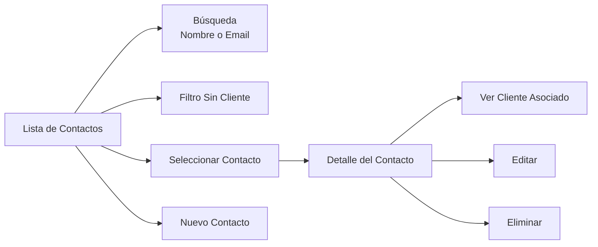
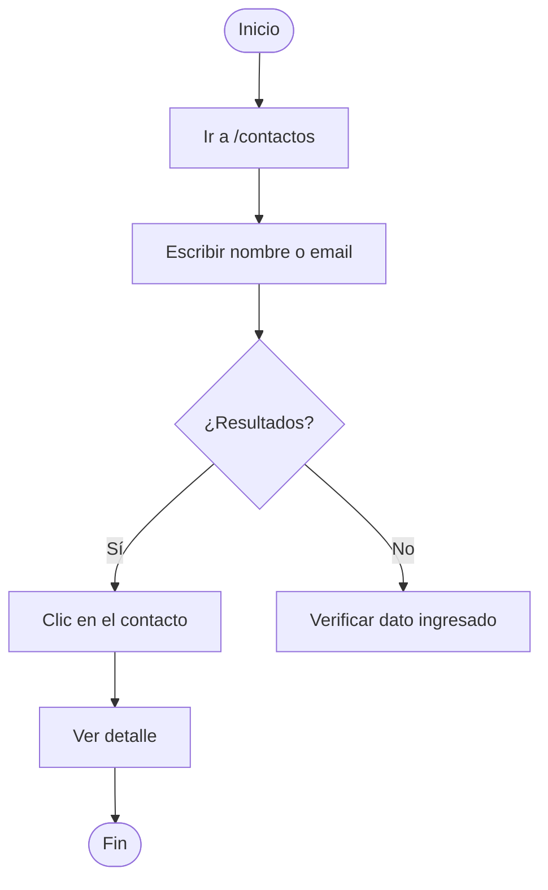
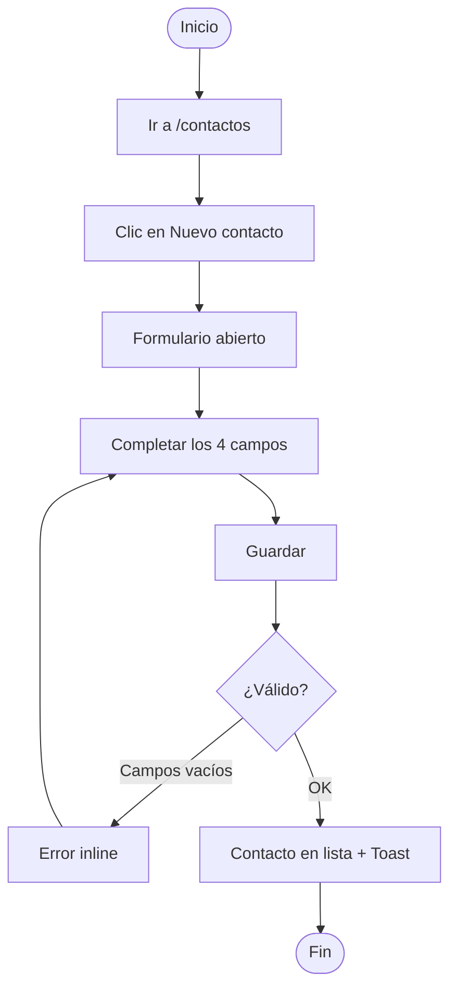
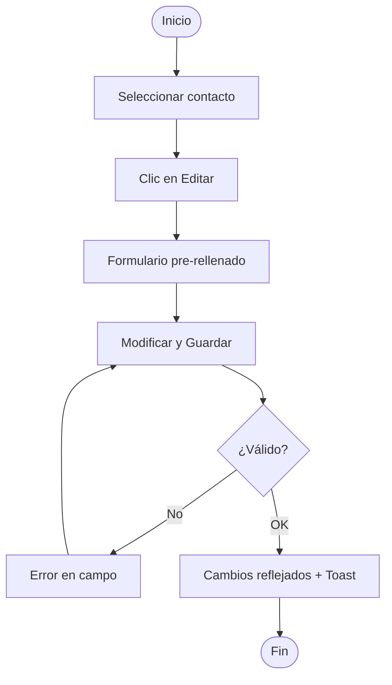
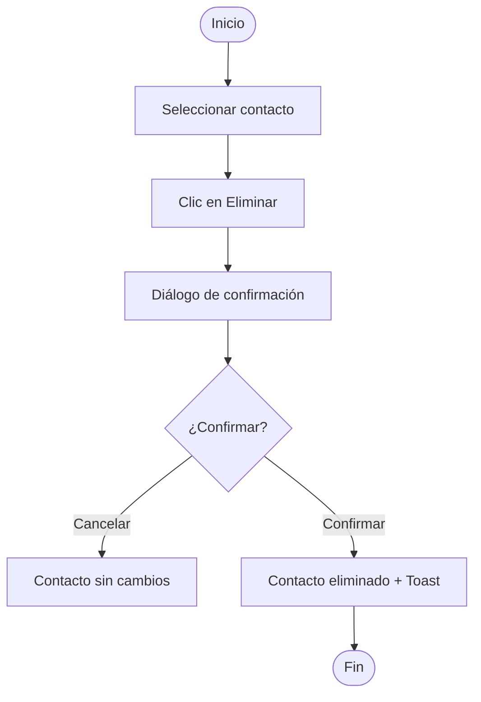
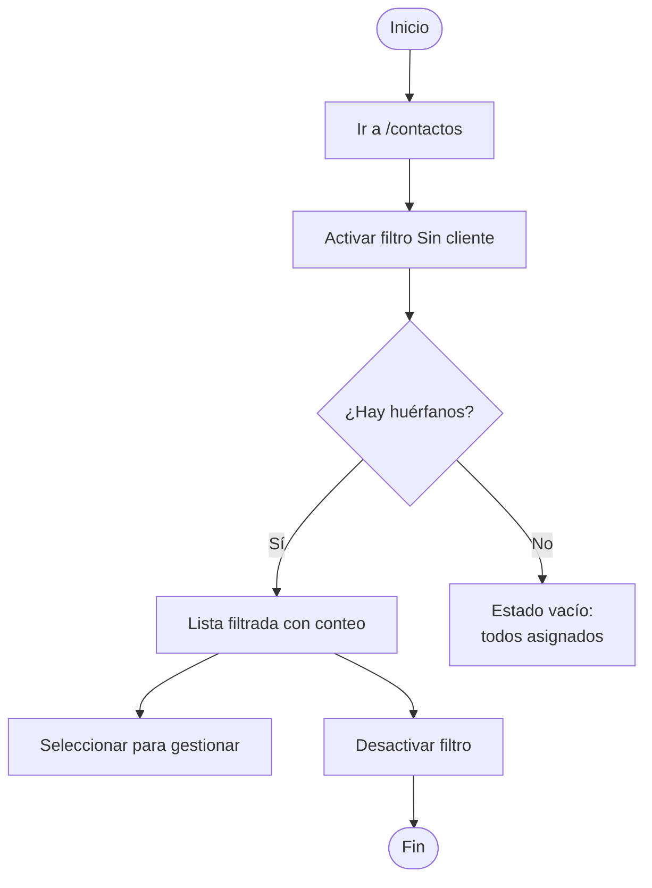

# Gestión de Contactos — Guía de Usuario

## Gestión de Contactos

La funcionalidad de Gestión de Contactos permite registrar y administrar personas de contacto de forma independiente. Desde `/contactos` puedes buscar por nombre o email, consultar el detalle de cualquier contacto, ver a qué cliente está asociado, crear, editar y eliminar contactos, y filtrar los que no tienen cliente asignado.

**Campos del registro de contacto:**

| Campo | Obligatorio | Descripción |
|-------|-------------|-------------|
| Nombre | ✅ | Nombre completo de la persona |
| Cargo | ✅ | Posición o título dentro de la empresa |
| Teléfono | ✅ | Número de contacto directo |
| Email | ✅ | Dirección de correo electrónico |

📸 [Screenshot: CONTACTOS_LISTA — Lista de contactos con Nombre, Cargo y Email visibles]

**[Source: F3 Story 3.1], [Source: F3 Story 3.2]**

---

## Flujos de Trabajo

### Flujo 1: Buscar un Contacto

**Objetivo**: Encontrar un contacto por nombre o email.

1. Navega a `/contactos`
2. Escribe nombre o email en el campo de búsqueda — la lista se filtra en tiempo real
3. Haz clic en el contacto para ver su detalle

📸 [Screenshot: CONTACTOS_BUSQUEDA — Búsqueda activa con lista filtrada]

💡 **Tip**: La búsqueda filtra por Nombre **o** Email. No es posible buscar por teléfono o cargo.

**[Source: F3 Story 3.1]**

---

### Flujo 2: Crear un Nuevo Contacto

**Objetivo**: Registrar un nuevo contacto en el sistema.

1. Navega a `/contactos`
2. Haz clic en **Nuevo contacto**
3. Completa los 4 campos requeridos: Nombre, Cargo, Teléfono, Email

📸 [Screenshot: CONTACTOS_CREAR_FORM — Formulario de creación con 4 campos requeridos]

4. Haz clic en **Guardar** → el contacto aparece en la lista con confirmación por toast

💡 **Tip**: Si quieres crear un contacto ya vinculado a un cliente, hazlo desde el detalle del cliente usando la sección de contactos asociados — el contacto quedará vinculado automáticamente.

**[Source: F3 Story 3.3]**

---

### Flujo 3: Editar un Contacto

**Objetivo**: Actualizar los datos de un contacto existente.

1. Selecciona el contacto en la lista
2. Haz clic en **Editar** — el formulario se abre pre-rellenado con los valores actuales
3. Modifica los campos y haz clic en **Guardar**

📸 [Screenshot: CONTACTOS_EDITAR_FORM — Formulario de edición pre-rellenado]

Los cambios se reflejan inmediatamente en el detalle y la lista para todos los usuarios.

**[Source: F3 Story 3.4]**

---

### Flujo 4: Eliminar un Contacto

**Objetivo**: Eliminar un contacto del sistema.

1. Selecciona el contacto en la lista
2. Haz clic en **Eliminar**
3. Confirma en el diálogo → el contacto es eliminado y la vista regresa a la lista

📸 [Screenshot: CONTACTOS_ELIMINAR_CONFIRM — Diálogo "¿Eliminar este contacto?"]

⚠️ La eliminación es permanente. Si el contacto tenía un cliente asignado, ese vínculo también desaparece. Si necesitas desvincular el contacto de un cliente sin eliminarlo, usa la función de desasociación desde el detalle del cliente.

**[Source: F3 Story 3.5]**

---

### Flujo 5: Filtrar Contactos Sin Cliente Asignado

**Objetivo**: Ver únicamente los contactos huérfanos (sin cliente).

1. Navega a `/contactos`
2. Activa el filtro **Sin cliente** — la lista muestra solo contactos con `clienteId = null` y su conteo
3. Selecciona cualquier contacto para gestionarlo o reasignarlo
4. Desactiva el filtro para volver a la lista completa

📸 [Screenshot: CONTACTOS_FILTRO_SIN_CLIENTE — Filtro "Sin cliente" activo con conteo visible]

💡 **Tip**: Los contactos huérfanos aparecen cuando un cliente es eliminado o cuando un contacto es creado sin asignarle un cliente. Usa este filtro periódicamente para mantener el catálogo ordenado.

**[Source: F3 Story 3.1], [Source: F3 Story 3.5]**

---

## Solución de Problemas

### No puedo guardar un contacto — aparecen errores

**Causa**: Campos obligatorios vacíos.
**Solución**: Completa todos los campos marcados en rojo (Nombre, Cargo, Teléfono, Email) y vuelve a guardar.

### No encuentro el contacto con la búsqueda

**Causa**: El término de búsqueda no coincide exactamente o se está buscando por un campo no soportado.
**Solución**: Prueba con otras partes del nombre o el email completo. Recuerda que la búsqueda es únicamente por **Nombre** o **Email** — no por teléfono ni cargo.

### El contacto muestra "Sin cliente asignado" pero debería tener uno

**Causa**: El contacto fue desvinculado de su cliente (por ejemplo, al eliminar el cliente al que pertenecía).
**Solución**: Ve al detalle del cliente correspondiente y usa la sección de contactos asociados para volver a vincularlo. Si no sabes a qué cliente asignarlo, reasígnalo desde el detalle del contacto.

### La lista de contactos no carga

**Causa**: El servidor no está disponible temporalmente.
**Solución**: Haz clic en **Reintentar**. Si el problema persiste, verifica tu conexión o contacta al administrador.

---

## Preguntas Frecuentes

**¿Un contacto puede pertenecer a más de un cliente?**
No. Un contacto solo puede estar asociado a un cliente a la vez. Para moverlo a otro cliente, usa la función de reasignación.

**¿Cómo sé si un contacto no tiene cliente asignado?**
En el detalle del contacto aparecerá *"Sin cliente asignado"*. También puedes usar el filtro "Sin cliente" en la lista para ver todos los contactos huérfanos de una vez.

**¿Puedo buscar contactos por teléfono?**
No. La búsqueda es únicamente por Nombre o Email.

**¿Los cambios son visibles para todos los usuarios inmediatamente?**
Sí. La aplicación actualiza los datos en tiempo real para todos los usuarios conectados.

**¿Qué pasa con un contacto si elimino el cliente al que pertenece?**
El contacto permanece en el sistema pero queda sin cliente asignado. Puedes encontrarlo en `/contactos` con el filtro "Sin cliente".

**¿Puedo crear un contacto directamente vinculado a un cliente?**
Sí. Abre el detalle del cliente y usa la opción de crear nuevo contacto desde la sección de contactos asociados — el contacto quedará vinculado automáticamente al cliente actual.

---

## Glosario

**Búsqueda en tiempo real**: Filtrado de la lista mientras el usuario escribe, sin necesidad de presionar Enter o un botón de buscar.

**Cargo**: Posición o título del contacto dentro de su empresa (ej: Gerente de Compras, Director Comercial).

**Contacto huérfano**: Contacto sin cliente asignado (`clienteId = null`). Visible con el filtro "Sin cliente".

**Email**: Dirección de correo electrónico del contacto. Campo obligatorio y usado para búsqueda.

**Filtro "Sin cliente"**: Opción en la lista de contactos que muestra únicamente los contactos sin cliente asignado, con su conteo total.

**Toast**: Notificación temporal de confirmación de una acción (ej: "Contacto creado correctamente"). Desaparece automáticamente.

**Validación inline**: Mensajes de error que aparecen junto al campo específico con el problema.

---

## Índice de Capturas de Pantalla

| ID | Sección | Descripción | Estado |
|----|---------|-------------|--------|
| CONTACTOS_LISTA | Gestión de Contactos | Lista con Nombre, Cargo y Email visibles | Pendiente |
| CONTACTOS_BUSQUEDA | Flujo 1 | Búsqueda activa con lista filtrada | Pendiente |
| CONTACTOS_CREAR_FORM | Flujo 2 | Formulario de creación con 4 campos | Pendiente |
| CONTACTOS_EDITAR_FORM | Flujo 3 | Formulario de edición pre-rellenado | Pendiente |
| CONTACTOS_ELIMINAR_CONFIRM | Flujo 4 | Diálogo "¿Eliminar este contacto?" | Pendiente |
| CONTACTOS_FILTRO_SIN_CLIENTE | Flujo 5 | Filtro "Sin cliente" activo con conteo | Pendiente |

**Total**: 6 capturas pendientes de capturar.

---

*Generado: 2026-03-18 · Feature: F3 — Gestión de Contactos · Estado: Borrador*
