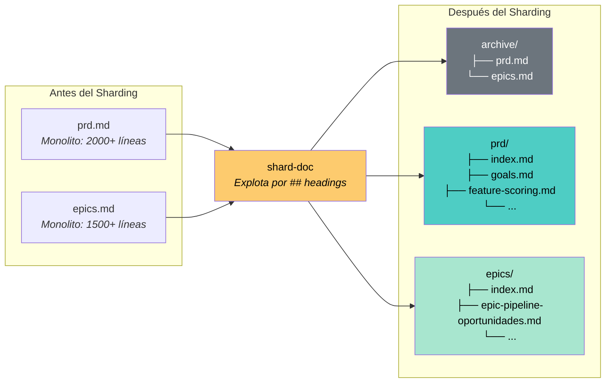
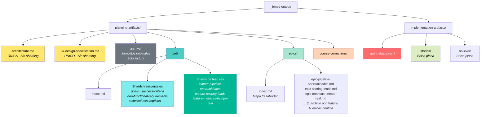
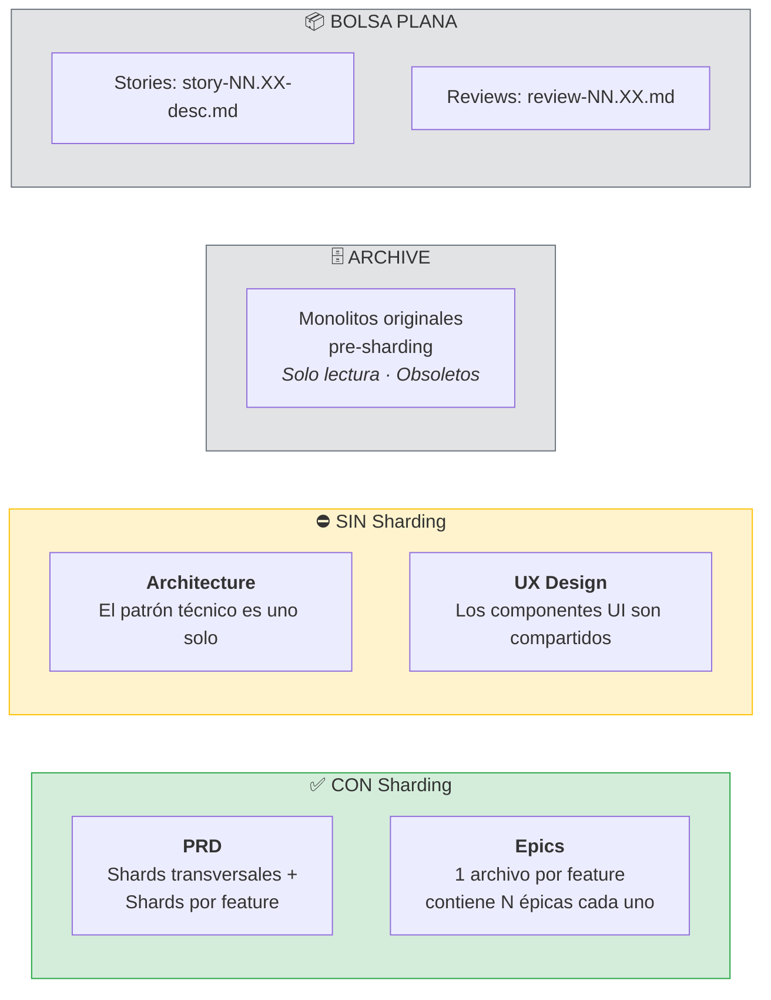
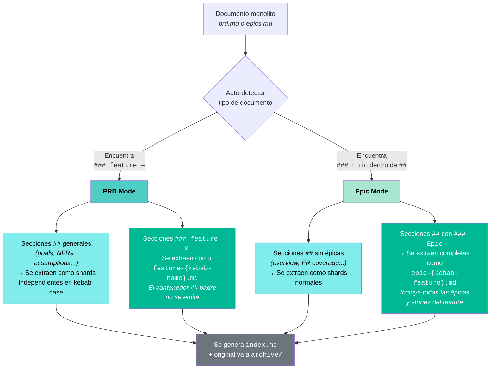
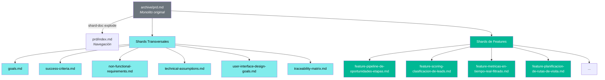

# Guía de Arquitectura: Sharding y Unificación para Mega-Proyectos BMAD6

> **Contexto:** Esta guía establece la estructura de directorios para mega-proyectos con muchas features que comparten el mismo patrón arquitectónico. Los documentos monolíticos se explotan en shards organizados por tipo, y el original se preserva en `archive/`.

---

## 1. El Patrón `archive/`

Cuando un documento se shardea, el archivo original **no se elimina**: se mueve a `archive/` como respaldo histórico. Lo que queda activo es la carpeta con los shards.



> **Regla:** `archive/` es de solo lectura. Nunca se edita. Es la foto histórica del monolito antes de ser explotado. A partir del sharding, **toda actualización ocurre exclusivamente en los shards** — el archivo archivado queda obsoleto por diseño y no debe consultarse como fuente de verdad.

---

## 2. Estructura Completa del Proyecto

### 2.1 Árbol de Directorios

```
gestor-comercial/
│
├── _bmad/                                       ← Configuración BMAD6
├── _bmad-output/
│   │
│   ├── project-context.md
│   │
│   ├── planning-artifacts/
│   │   │
│   │   ├── architecture.md                      ← ÚNICA arquitectura (sin sharding)
│   │   ├── ux-design-specification.md           ← ÚNICO diseño UX (sin sharding)
│   │   ├── implementation-readiness.md
│   │   │
│   │   ├── archive/                             ← MONOLITOS ORIGINALES (solo lectura)
│   │   │   ├── prd.md                           (snapshot pre-sharding)
│   │   │   └── epics.md                         (snapshot pre-sharding)
│   │   │
│   │   ├── prd/                                 ← SHARDS DE PRD
│   │   │   ├── index.md                         (navegación + tabla de contenido)
│   │   │   ├── table-of-contents.md
│   │   │   ├── goals.md                         ← Shard transversal
│   │   │   ├── success-criteria.md              ← Shard transversal
│   │   │   ├── non-functional-requirements.md   ← Shard transversal
│   │   │   ├── technical-assumptions.md         ← Shard transversal
│   │   │   ├── user-interface-design-goals.md   ← Shard transversal
│   │   │   ├── traceability-matrix.md           ← Shard transversal
│   │   │   ├── pm-checklist-results.md
│   │   │   ├── feature-pipeline-de-oportunidades-etapas.md
│   │   │   ├── feature-scoring-clasificacion-de-leads.md
│   │   │   ├── feature-metricas-en-tiempo-real-filtrado.md
│   │   │   ├── feature-personalizacion-de-dashboard.md
│   │   │   ├── feature-planificacion-de-rutas-de-visita.md
│   │   │   └── ...
│   │   │
│   │   ├── epics/                               ← SHARDS DE EPICS (1 archivo por feature)
│   │   │   ├── index.md                         (mapa: Feature → Épicas → PRD Shard)
│   │   │   ├── epic-pipeline-de-oportunidades.md        (contiene N épicas del feature)
│   │   │   ├── epic-scoring-clasificacion-leads.md      (contiene N épicas del feature)
│   │   │   ├── epic-metricas-tiempo-real.md             (contiene N épicas del feature)
│   │   │   ├── epic-personalizacion-dashboard.md        (contiene N épicas del feature)
│   │   │   └── ...
│   │   │
│   │   └── course-corrections/                  ← HISTORIAL DE DECISIONES
│   │       ├── cc-001-initial-scope.md
│   │       ├── cc-002-add-rutas-de-visita.md
│   │       └── ...
│   │
│   └── implementation-artifacts/
│       ├── sprint-status.yaml                   ← PUNTERO DE EJECUCIÓN (único)
│       ├── stories/                             ← BOLSA PLANA DE STORIES
│       │   ├── story-01.01-pipeline-api.md
│       │   ├── story-01.02-pipeline-frontend.md
│       │   ├── story-02.01-scoring-api.md
│       │   └── ...
│       └── reviews/                             ← BOLSA PLANA DE REVIEWS
│           └── ...
│ 
├── .agents/                                    ← Funciona para Claude y OpenCode
│   │
│   ├── skills/
│   │   │
│   │   ├── finance-sa-dto-inventory/            ← Expone DTO del módulo de inventario
│   │   │   ├── SKILL.md
│   │   └── dominio-sa-name-skill/               ← Expone información relevante para otros equipos
│           └── SKILL.md
├── .claude/
│   │
│   ├── skills/
│   │   │
│   │   ├── finance-sa-dto-inventory/       
│   │   │   ├── SKILL.md
│   │   └── dominio-sa-name-skill/                      
            └── SKILL.md

```

### 2.2 Diagrama de Distribución



### 2.3 Qué Tiene Sharding y Qué No



---

## 3. Cómo Funciona el Sharding Inteligente

El sharding no es un split mecánico por líneas — es una tarea ejecutada por el agente BMAD que **auto-detecta el tipo de documento** analizando sus headings y aplica reglas de extracción distintas según el modo:



> En ambos modos, el agente presenta el mapa de secciones detectado al usuario para confirmación antes de ejecutar. El monolito original se mueve a `archive/` automáticamente.

---

## 4. Anatomía de los Shards de PRD

El PRD no se shardea solo por feature. También se extraen las secciones transversales como shards independientes:



> Los shards transversales contienen reglas que aplican a **todas** las features. Los shards de feature contienen reglas de negocio específicas de esa funcionalidad.
